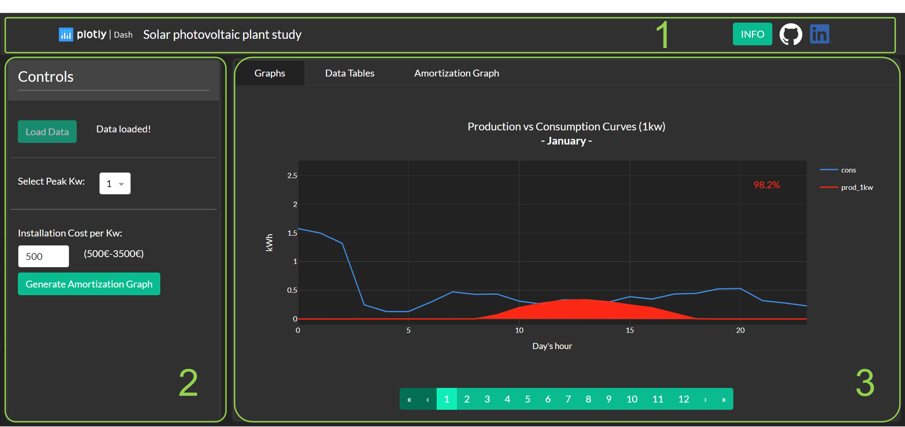
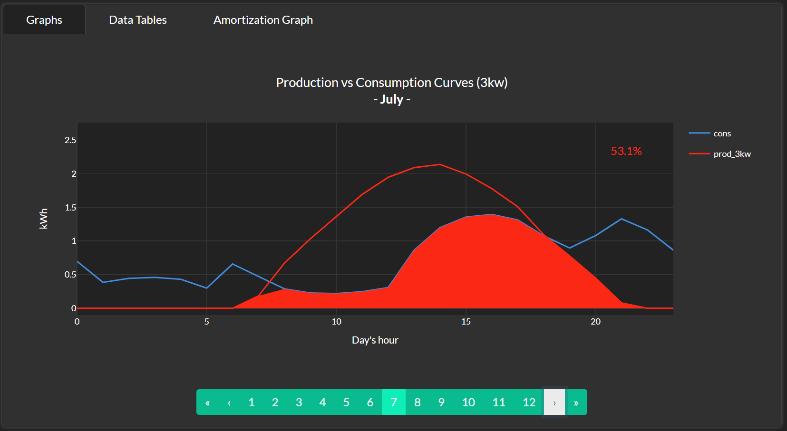
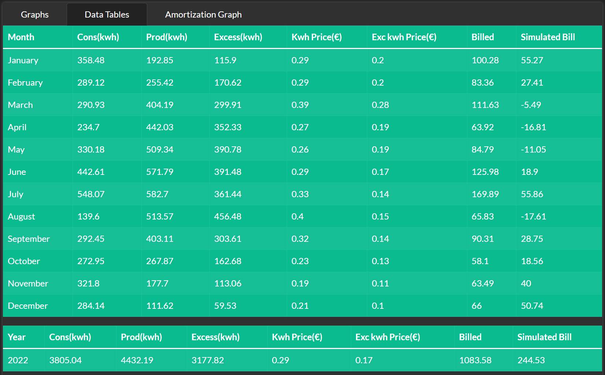
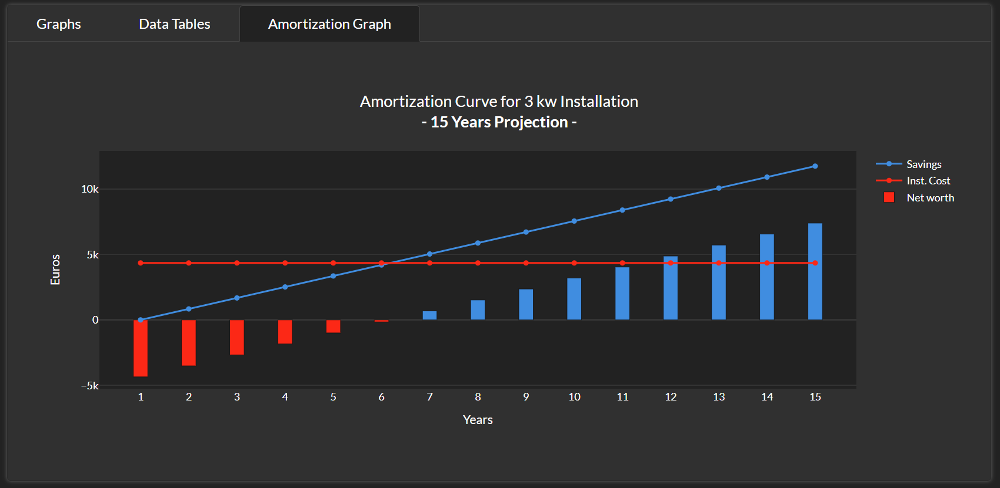

# Solar Photovoltaic Plant Study Tool
> This application is intended to get some insights about benefits and costs when installing a solar photovoltaic plant at home. It is based in real consumption and electricity price data and also in production data of a domestic real photovoltaic plant that was taken as a reference. The tool has been designed using Plotly Dash 2.9.3 in Python 3.6.

## Table of contents
* [Executive Summary](#executive-summary)
* [Interface Description](#interface-description)
* [Notes](#notes)

## Executive Summary
The application is designed to obtain main data about:
1. Graph with the average amount energy that would be consumed during a day, from the one generated by the plant, per hour and per month
2. Average total percentage of energy that would be consumed during a day, from the one generated by the plant, per month
3. Table data with figures, per month, about energy consumed, produced, prices of the consumed energy and also the excess that is sent back to the grid and finally real billed amount and estimated billed amount if plant was in installed
4. Based on the table data an amortization figure is also get in which you can check the amount of time (in years) to break in the cost of installation by the savings generated by the installation plant

All those data can be fine-tuned with two parameters:
* Peak power of the installed plant (in kw)
* Cost of installation per peak kw

## Interface Description

The three main tool areas are:
1. Navigation bar
2. Control area
3. Visualization area

In the navigation bar there is an INFO button that displays main information about the application. Besides, there are two links: one to the Github repo for this application and another one to my LinkedIn profile.

In the second area, the one with the controls, you will find first the 'Load Data' button. You will need to click that button to get the data loaded from the server. If the page is refreshed, the data will be lost and you will need to click it again.

You sill also find two selectors, one to select the photovoltaic plant installation size (in terms of peak power in kw) and another one to select the cost (per peak power in kw) of the installation. With these two data the different graphs and tables are modified accordingly. Finally, the 'Generate Amortization Graph' button needs to be clicked every time you want that graph to be updated if any of the two properties is modified. However, the table data and the main graph are only reactive to the first selector and they are automatically updated by changing it.

The 'Main Graph' tab of the visualization area shows two figures: the production of the photovoltaic plant per day's hour (in kwh) in red and the consumption data per day's hour in blue. We have one of these graphs per month and you can navigate across them using the navigation pannel below the graph. The data at every day's hour is an average, for that specific hour along the whole month for both figures. What is more, there is a shadowed red area for the amount of produced electricity that would be consumed so we can visualize how much would be consumed and how much would be returned back to the grid. The exact percentage of produced electricity consumed is also shown in the top right corner of the graph.

The 'Data Tables' tab of the visualization area shows several figures per month (on the first table) and also summed up per year (on the second table) such as:

* Energy consumed (in kwh)
* Energy produced (in kwh)
* Excess of energy produced (so not consumed) returned to the grid (in kwh)
* Prices (in euros) for the consumed energy and also the price paid for the excess returned to the grid
* Billed amount for the consumed electricity (excluding fixed concepts and taxes)
* Bileed amount for the consumed electricity if the photovoltaic plant would have been in place

Finally, the 'Amortization Graph' tab of the visualization area shows the break in point (in years) when the savings produced by the photovoltaic plant equals the installation costs. Besides, a fifteen years projection is done for the accumulated net worth of the plant. 

## Notes

Few notes about the application and the data represented on it: 

* The consumption data is real data, obtained from my electricity company, averaged by hour for each month
* The original CSV for that data contained one row per hour for a whole year (8760 samples)
* The production data is real data from a solar photovoltaic plant of a friend
* Although location is near my own house, it is not exactly the same and also the type of building is different
* However, I found that these data are more real that some other data produced by simulators found over the internet
* That data is also averaged by hour for each month and the original data contained a row for every 15 minutes period over a whole year (3540 samples)
* As the data is not much, I've decided to previously generate the figures (go.Figure plotly objects) based on the initial data and save them as JSON files on the server
* Then, those files are read when the 'Load Data' button is clicked and are stored in the client browser by means of Dash Core Component Store objects
* I've used that approach so the application is faster on loading the data, but of course, this approach is only valid when the data is not very big